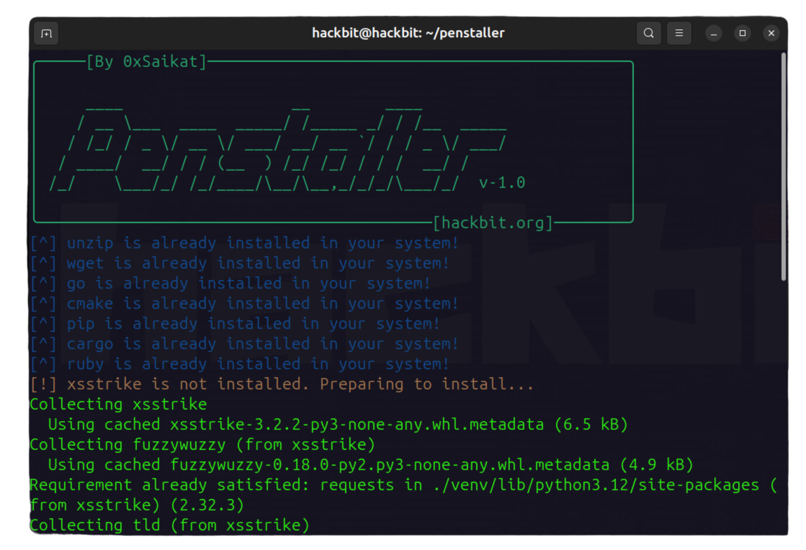

# Penstaller - Pentesting & Bug Hunting Toolkit Installer

 

Penstaller is a Python-based automation tool designed to simplify the installation of essential bug bounty and penetration testing tools. With just one command, Penstaller sets up your system with all the necessary tools for reconnaissance, fuzzing, web vulnerability scanning, and more. It ensures a clean and efficient setup, saving you time and effort when configuring new environments for bug hunting or security testing. Perfect for both beginners and seasoned professionals, Penstaller keeps your system lightweight and ready for action.



----

## Overview

The `Penstaller` script handles:

→  Installation of essential programming languages and package managers like Go, CMake, Pip, and Cargo.

→  Automated installation of various pentesting tools, including subdomain enumeration, fuzzing, web reconnaissance, and more.

→  A detailed list of recommended wordlists to be manually installed for enhanced performance.

### Workflow Example
----
>📌 Start Fresh: Boot into a clean OS with no pre-installed bloatware.

>📌 Run Penstaller: Execute the script to automatically install your entire bug bounty & pentesting toolkit.

>📌 Get to Work: Once completed, you are ready to start bug hunting and pentesting without any unnecessary clutter on your system.

----

## Included Tools

|                |              |             |            |            |             |             |
|----------------|--------------|-------------|------------|------------|-------------|-------------|
| `unzip`          | `wget`         | `go`         | `cmake`      | `pip`         | `cargo`       | `ruby`       |
| `xsstrike`       | `dalfox`       | `puredns`    | `httprobe`   | `naabu`       | `hakrawler`   | `gospider`   |
| `LinkFinder`     | `SecretFinder` | `subjs`      | `xnLinkFinder` | `cors`       | `gobuster`    | `nikto`      |
| `wpscan`         | `jq`           | `x8`         | `urldedupe`  | `qsreplace`   | `gau`         | `gf`         |
| `waybackurls`    | `uro`          | `ffuf`       | `anew`       | `subfinder`   | `httpx`       | `nmap`       |
| `dirsearch`      | `amass`        | `sublist3r`  | `assetfinder` | `nuclei`      | `massdns`     | `shuffledns` |
| `paramspider`    | `arjun`        | `katana`     | `sqlmap`     | `ghauri`      | `pii`         | `pdsi`       |

### Prerequisites

Before using `Penstaller`, make sure your system meets the following prerequisites:

> - **Operating System**: Ubuntu/Debian-based distributions (support for other Linux distributions may vary).
> - **Install the Requirements.txt**: Install the requirements.txt with `pip3 install -r requirements.txt`. Ensure you have the necessary permissions.
> - **Internet Connection**: A stable internet connection is required to download the tools and dependencies.

## How to Install and Use

To use FindME, follow these steps:

1. ### Clone the repository:
   ```bash
   git clone https://github.com/0xSaikat/penstaller.git
   cd penstaller
2. ### Install the required dependencies:
   ```bash
   pip3 install -r requirements.txt

3. ### Give permissions:
    ```bash
   chmod +x penstaller.py
    
4. ### Run the FindME tool:
    ```bash
   python3 penstaller.py

### 5. Next Manually Install Wordlists
After running the script, you'll need to manually install the recommended wordlists:

- **SecLists**: [SecLists GitHub](https://github.com/danielmiessler/SecLists)
- **OneListForAll**: [OneListForAll GitHub](https://github.com/six2dez/OneListForAll)
- **bbFuzzing**: [bbFuzzing GitHub](https://github.com/reewardius/bbFuzzing.txt.git)
- **PayloadsAllTheThings**: [PayloadsAllTheThings GitHub](https://github.com/swisskyrepo/PayloadsAllTheThings.git)
- **Dirsearch Wordlist**: [Dirsearch Wordlist](https://github.com/maurosoria/dirsearch/blob/master/db/dicc.txt)
- **Gf-Patterns**: [Gf-Patterns GitHub](https://github.com/1ndianl33t/Gf-Patterns)
- **More Gf-Patterns**: [Gf-Patterns Collection GitHub](https://github.com/emadshanab/Gf-Patterns-Collection.git)
- **Nuclei-Templates**: [Nuclei-Templates GitHub](https://github.com/projectdiscovery/nuclei-templates.git)
- **Commonspeak2**: [Commonspeak2 Wordlist](https://wordlists-cdn.assetnote.io/data/manual/best-dns-wordlist.txt)

The script will provide the full list of wordlists and corresponding links when it's run.

## About Me

I am **Sakil Hasan Saikat**, a cybersecurity enthusiast and the founder of [HackBit](https://hackbit.org). I specialize in offensive security, penetration testing, and building automated tools for cybersecurity research. My passion for ethical hacking has driven me to create several tools that contribute to the security community.

You can learn more about my work on my personal website: [https://saikat.hackbit.org](https://saikat.hackbit.org).

Connect with me on [LinkedIn](https://www.linkedin.com/in/0xsaikat/) for updates and collaborations.


## HackBit

[HackBit](https://hackbit.org) is a cybersecurity-focused organization committed to discovering vulnerabilities, creating solutions, and making the internet a safer place. Join us in our mission to secure the digital world.

###### Waving the Internet Securely!

### License

This project is licensed under the MIT License - see the [LICENSE](LICENSE) file for details.

<br>
<br>
<br>

<h6 align="center">By the Hackers for the Hackers!</h6>

<div align="center">
  <a href="https://github.com/0xSaikat"></a>
  <a href="https://twitter.com/0xSaikat"></a>
</div>
